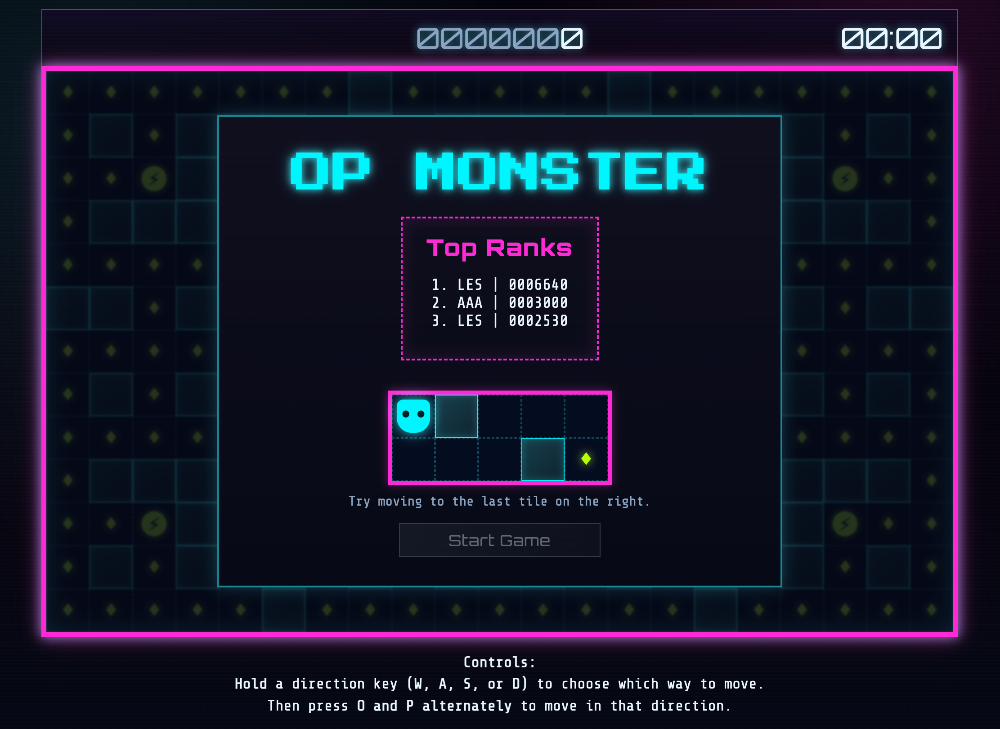
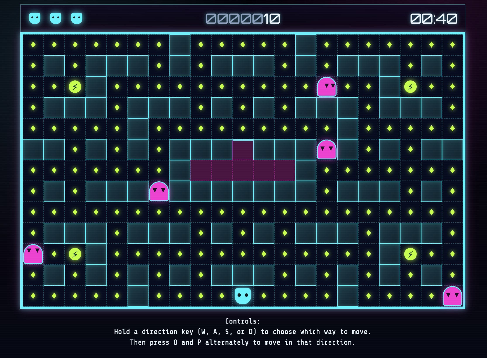
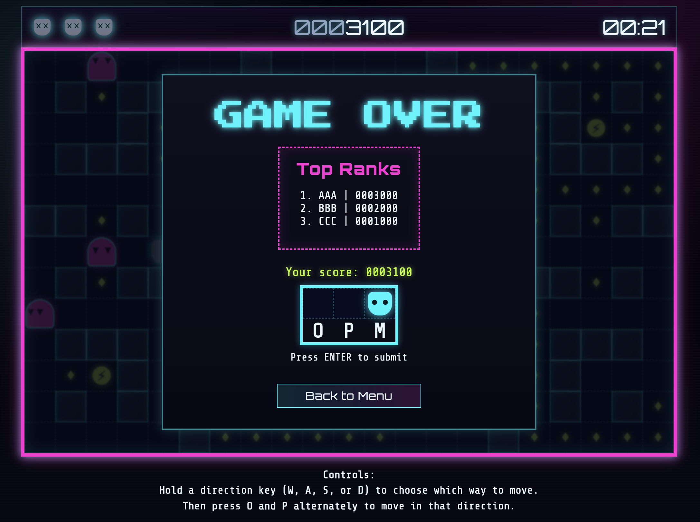

# GA SEB Unit 1 - Project OP Monster

A game of **coordination**, **reaction speed**, and **decision-making** within 60 seconds.

## About OP Monster

The game was inspired by the classic **Pac-Man** where the player **navigates the maze**, and **collects points** while **avoiding ghosts**.

As a fan of mash-and-bash fast-paced games such as **[Bishi Bashi Arcade](https://en.wikipedia.org/wiki/Bishi_Bashi)**, I've introduced a **two-key (O & P)** alternating movement mechanic paired with traditional **WASD** directional controls, hence the name **OP Monster**.

## The Game

Game link: **[Play OP Monster Now!](https://leslietan1981.github.io/GA-Unit1-Project-OPmon/)**

Like most arcade-style games, **OP Monster** is a semi-discovery game: _you learn as you play_.

**Game controls:**

- **Hold** a directional key **(W, A, S, or D)** to choose which way to move. This can be seen by the direction the **player eyes** are looking at.
- Then **tap O and P keys alternately** to move in that direction.

## Current Features

Current features include:

- **Dynamically generated maze:** a two-dimensional data array (`mazeLevelData.js`) produced using a **level-design tool**.
- **Unique input system:** using **WASD keys** as directional control and **alternating OP keys** as movement control.
- **Movement restriction:** a check feature to restrict the movement of **Avatars** (player and ghosts) to be within paths.
- **Visual and audio cues:** to provide feedback of actions.
- **Onboarding gameplay:** to help players familiarize themselves with the controls.
- **Leaderboard:** using `localStorage` to keep score over sessions.
- **OnInterval cycles:** use of `setInterval` to check and update game states **over time** (including speeding up Ghost decision-making as the game progresses).
- **Simple pathfinding:** to allow Ghosts to move towards or away from Player.

## User Flow

1. **Start Screen** → Shows leaderboard → Play onboarding → Click "Start Game"
2. **Countdown Screen** → Countdown to game start (Ready-OP)
3. **Game Screen** → Player moves using key controls → Check for valid movement direction → Check for gems → Check for power-ups → Check for ghosts → Check for game over
4. **Game Over Condition** → Shows leaderboard → Shows score → Check if eligible for leaderboard → Enter initials if eligible → Back to menu
5. **Back to Menu** → Reset game state → Return to start screen

## Initial Planning

You may refer to **[this document](planning-materials/initial-planning.md)** for the initial plans.

## Attributions

- Sounds were sourced from **[Pixabay](https://pixabay.com/)**.
- **Copilot** was used to enhance the final visuals of the game, including the **colour scheme, fonts, and CSS animations**. No JS game logics were harmed in the process. 😈

## Tech Stack

The project production was driven by **limiting myself** to the skills, knowledge and tools that I have **acquired in Unit 1**.

And with that, the only technologies I used were:

- **HTML:** Base layout structure
- **CSS:** Re-skinable visual styles
- **JS:** Game logic and mechanics
  (No frameworks or libraries were used.)

## Next Steps

Maybe a **two-player mode** would be a nice touch, where players can compete for the highest score. **Pure chaos!**
